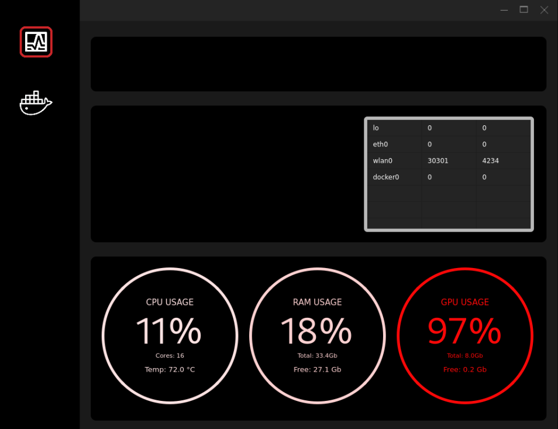

Monitor 
======= 

### Venv:
######  python3.9
###### /monitor
```
python -m venv .venv && \
source .venv/bin/activate && \
pip install -U pip && \
pip install -r requirements.txt
```
### Run:
###### /monitor
```
python main.py
```

### Docker:
###### /monitor
```
```
**Note:**
###### Help:
- ###### / inside root directory or cd /xxx  
###### [Links:]()
- ###### [Link](https://drive.google.com/file/d/1SicDsXPs8zEA4twHtZ0IhoW7U_wKqBSo/view?usp=sharing) Download one file executable
